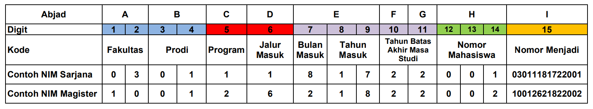
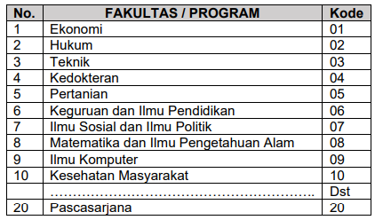
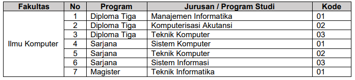
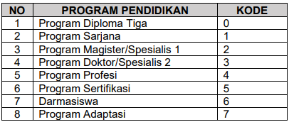
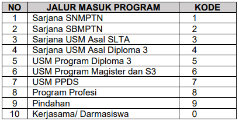
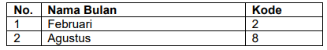
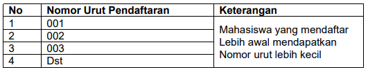
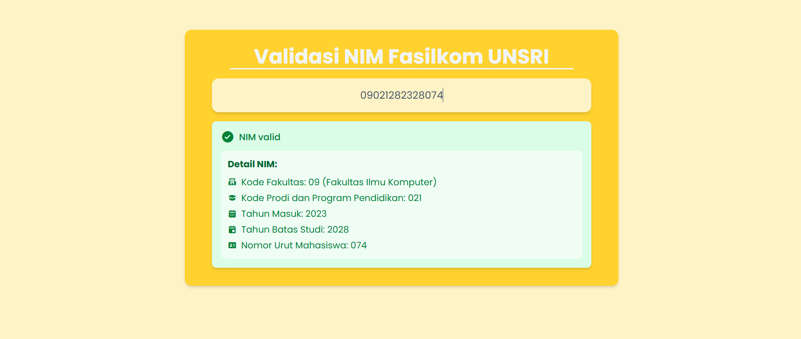

# 🎓 NIM Validation Using Regular Grammar

> **Developed by:**
> - [M. Rabyndra Janitra Binello](https://github.com/ElloRabyndra)
> - [Monica Amrina Rosyada](https://github.com/monriie)
> - [Isa Rasendrya Arzano](https://github.com/IsaCuteAsF)
> - [Beryl Ahmad Zafirsyah Gumay]()


A web-based system to validate **Student Identification Numbers (NIM)** for students of the **Faculty of Computer Science, Universitas Sriwijaya**. This project utilizes **regular grammar rules** to determine the validity of a NIM structure.

---

## 🚀 Tech Stack

- Python
- Flask
- JavaScript
- Tailwind CSS

---

## 📚 About NIM Structure

The NIM (Nomor Induk Mahasiswa) follows a strict format based on various components like faculty code, study program, admission path, etc. This project uses **regular grammar** to define and validate the structure.


---

### 🧾 NIM Structure Table

> Below are the official code references used for validation:

#### 📄 NIM Grammar Table


#### 🏫 Faculty Code


#### 🧑‍🎓 Program Study Code


#### 🎓 Education Program Code


#### 🎫 Admission Path Code


#### 📅 Entry Month Code


#### 🔢 Student Serial Number Format


---

## 🛠️ How to Run This Project

Follow the steps below to run the project on your local machine:

1. **Clone the repository**
    ```bash
    git clone https://github.com/your-username/nim-validator.git
    cd nim-validator
    ```

2. **Open the folder in your IDE or code editor**

3. **Run the application**
    ```bash
    python app.py
    ```

4. **Open your browser and go to:**
    ```
    http://127.0.0.1:5000/
    ```

---

## 📸 Screenshot


---
